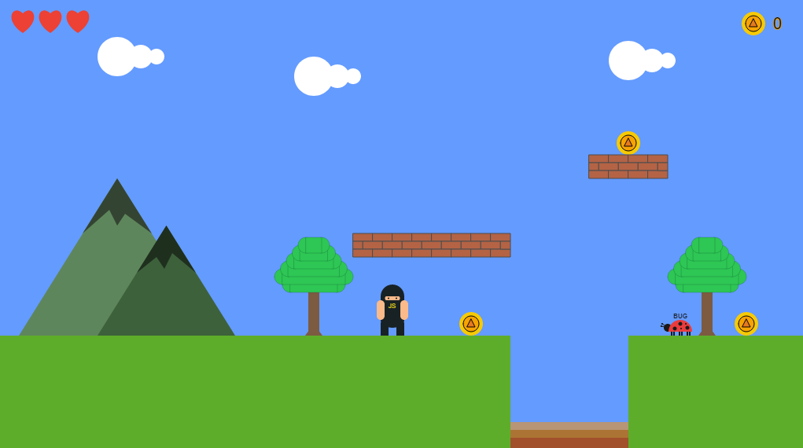

# Game Project

### **Author :** Nicolas Conde Salazar

## Game Description

I made my game project mainly inspired on the Mario Bross game, there are two classes ‘Character’ and ‘Enemy’ that because those are the main elements in the game that interact each other, the other elements were built using the factory patterns which are simple reusable functions and then are drawn through a loop, and finally a function that handles some game interactions.

## The extensions of the game are:

-  Sounds upon jump, collect a coin, collect an extra live, die, win the game, lose the game and background music.
-  Load an image of a castle.
-  Platforms with collectables on top of it
-  Gravity for the character and the enemies
-  Speed for the character
-  File directory to make the code readable and maintainable
-  Among other things

## Difficulties

The hardest part by far was adding the gravity function to the game, the business logic was somewhat difficult to think about.

## What I learned

By completing this project, I have learned about builder functions, factory pattern, p5.js library, business logic for a game project, I have never built a game application before, I really enjoyed the experience.
